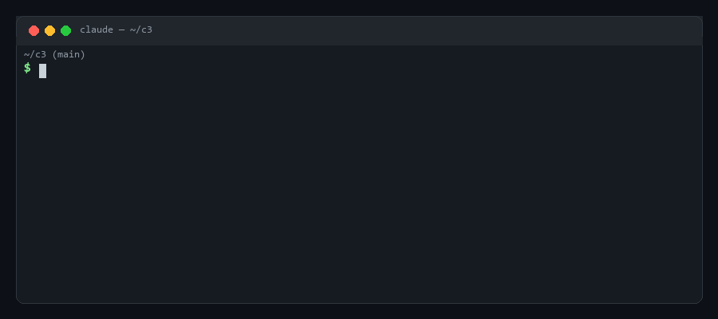
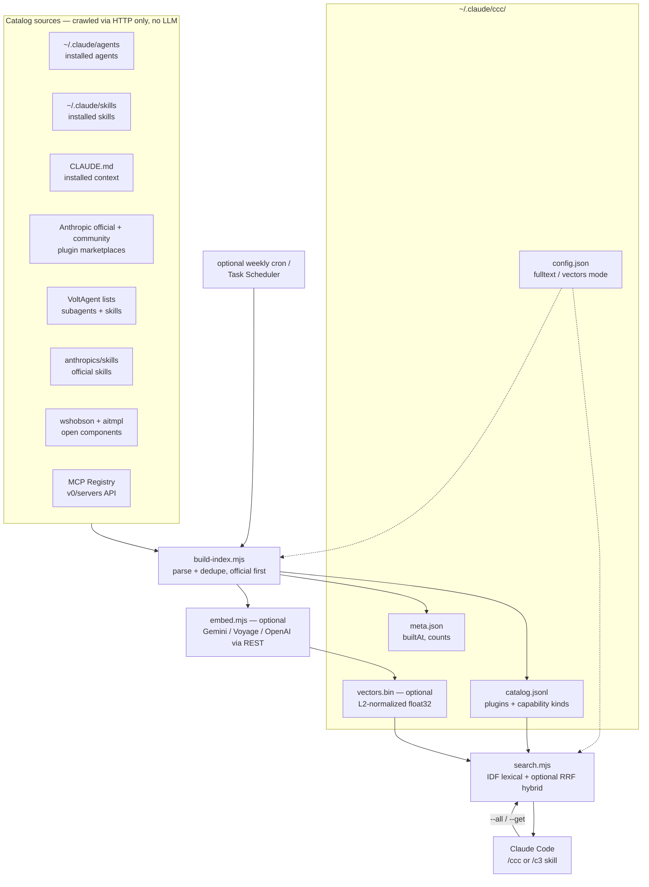
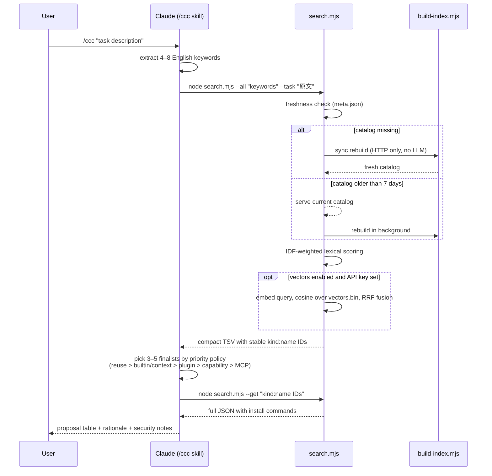
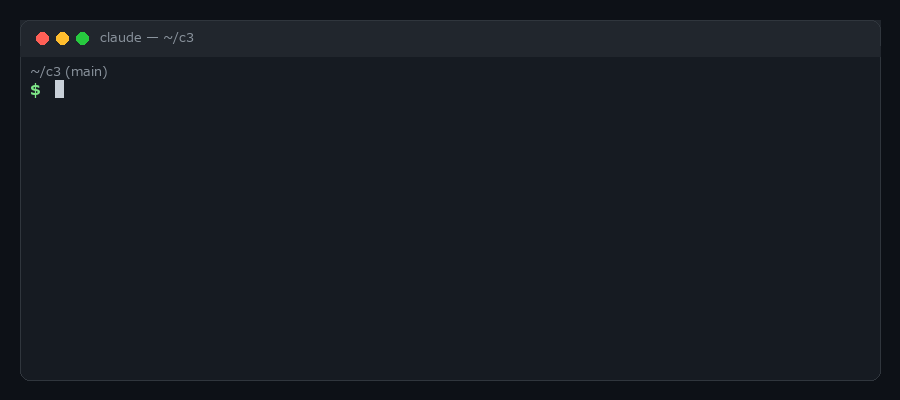

# c3 — Claude Code Concierge

> **Don't reinvent the wheel.** The Claude Code ecosystem already ships thousands of plugins, agents, skills, hooks, LSP servers, and MCP servers. The hard part isn't building your own — it's knowing what already exists. c3 checks *before* you build.

**/ccc** (or **/c3**) tells you the best combination of Claude Code **plugins, subagents, skills, hooks, LSP servers, monitors, output styles, persistent context, and MCP servers** for whatever task you describe — using a **local RAG catalog** so that each recommendation costs almost zero tokens.

```
/ccc I want to build a Stripe subscription billing page
```

→ Returns a prioritized proposal table (what to reuse, what to install, what *not* to install) with ready-to-run install commands.

## Demo



## Why

c3 was born from a habit worth automating: every time you're about to hand-roll a subagent, a prompt, or an integration, someone in the ecosystem has probably already built — and debugged — a better one. Reuse beats rebuild, which is why c3's recommendation policy literally starts with *"no addition needed — reuse what you already have."* The catalog indexes Claude Code's built-ins, your installed agents/skills and persistent context, then official and public marketplaces before broader community sources.

But checking the ecosystem by hand (or letting an LLM web-research it) costs real time and 100k+ tokens per question. c3 splits the work:

| Phase | Frequency | Cost |
|---|---|---|
| **Crawl** — build `~/.claude/ccc/catalog.jsonl` from public sources | on first use; then when stale (>7 days), in the background | HTTP only, no LLM calls |
| **Retrieve** — IDF-weighted keyword search over the catalog | every request | milliseconds, zero API cost |
| **Propose** — Claude synthesizes the combination | every request | a few thousand tokens |

Default path: no embedding API, no npm dependencies — Node.js standard library only. Optional `--vectors` mode adds a REST embedding call (still no npm packages).

## How it works

### Architecture



### Query flow



## Catalog sources and kinds

- Built-in Claude Code capabilities and installed persistent context (`CLAUDE.md`) — reuse comes first
- [Anthropic official plugin directory](https://github.com/anthropics/claude-plugins-official) — Anthropic-curated plugins plus its published Hook, LSP, Output Style, and Context components
- [Anthropic community plugin directory](https://github.com/anthropics/claude-plugins-community) — community plugins distributed through an official marketplace
- [Anthropic Knowledge Work Plugins](https://github.com/anthropics/knowledge-work-plugins) — open official role-based plugins
- Your already-installed agents and skills (`~/.claude/agents/`, `~/.claude/skills/`)
- [wshobson/agents](https://github.com/wshobson/agents) plugin marketplace (94 plugins)
- [VoltAgent/awesome-claude-code-subagents](https://github.com/VoltAgent/awesome-claude-code-subagents) (100+ agents)
- [anthropics/skills](https://github.com/anthropics/skills) — official Anthropic skills
- [VoltAgent/awesome-agent-skills](https://github.com/VoltAgent/awesome-agent-skills) — vendor & community skills
- [aitmpl.com](https://github.com/davila7/claude-code-templates) components catalog (800+ community skills)
- [Official MCP Registry](https://registry.modelcontextprotocol.io) (~2,300 active servers)

Source counts above are approximate (as noted in the indexer). Add sources by editing `skills/ccc/scripts/build-index.mjs` (one function per source).

### Catalog classification

| `kind` | What it represents |
|---|---|
| `builtin` | Claude Code capability that needs no installation |
| `context` | Persistent instructions such as `CLAUDE.md`, or a plugin that manages them |
| `plugin` | A distribution bundle that can contain several capability types |
| `skill` | Reusable instructions, knowledge, or an invocable workflow |
| `agent` | An isolated worker with its own context |
| `hook` | Deterministic lifecycle automation or enforcement |
| `lsp` | Language-server integration for diagnostics and code navigation; results state the required server binary and setup reference |
| `monitor` | Background monitoring configuration; the catalog explicitly says when authoring is required because no installable official plugin is published |
| `output-style` | Response-format or presentation behavior |
| `mcp` | Connection to an external service or tool provider |

Where the source exposes enough structured information, classification uses independent facets rather than forcing everything into one hierarchy:

- `kind`: what the record does
- `distribution`: `builtin`, `standalone`, `plugin`, or `plugin-component`
- `domain`: normalized task area such as development, security, data, infrastructure, or productivity
- `execution`: how it runs, such as prompt, isolated agent, deterministic hook, external service, or background monitor

Marketplace-provided tags are preserved. `anthropic-authored` means the listed author is Anthropic; `anthropic-curated` means the plugin is listed in Anthropic's directory; and tags such as `community-managed` stay attached to third-party entries. A public marketplace listing does not by itself assert an open-source license.

These optional facets let search distinguish a plugin (packaging), a Hook (execution behavior), and security (domain) instead of treating them as equivalent categories. Legacy/community entries without reliable metadata continue to work through `kind`, tags, descriptions, and fulltext.

`--all` returns a stable `id` column in `kind:name` form. Pass those IDs to `--get` when requesting details; a bare name is still accepted only if it identifies one record.

Catalog builds a local search index on your machine. In default fulltext mode, that local `catalog.jsonl` can include names, tags, descriptions, and clipped body text from installed agents/skills and selected public skill sources (up to 4,000 chars per entry); `--no-fulltext` skips body indexing. That does **not** re-license those upstream projects — each plugin, agent, skill, Hook, LSP configuration, Output Style, or MCP server remains under its own license and terms. c3 points you at candidates; you still follow each project's license when you install or reuse it. Public endpoints and upstream ToS can change; the indexer may then skip or drop a source.

## Install

**Prerequisites**: [Node.js](https://nodejs.org/) (for catalog build/search) and [Claude Code](https://docs.anthropic.com/en/docs/claude-code).

```sh
git clone https://github.com/happygoluckydev/c3.git
cd c3
sh install.sh        # Windows PowerShell: ./install.ps1
```

This copies the skill to `~/.claude/skills/ccc/` and the `/c3` command alias to `~/.claude/commands/`, and writes `~/.claude/ccc/config.json`. Restart your Claude Code session, then run `/ccc <task>` or `/c3 <task>`.

### Install options

| sh | PowerShell | Effect |
|---|---|---|
| (default) | (default) | Lexical search incl. document bodies (fulltext). Zero external services. |
| `--no-fulltext` | `-NoFulltext` | Lite: skip body indexing — catalog ~half the size, slightly lower recall. |
| `--vectors gemini\|voyage\|openai` | `-Vectors gemini` | Hybrid search: lexical + embedding ranks fused with RRF. Needs `GEMINI_API_KEY` / `VOYAGE_API_KEY` / `OPENAI_API_KEY`. Rebuild cost depends on the current catalog size (several thousand short texts); queries are one embed call each. |

Options are stored in `~/.claude/ccc/config.json` — edit it (or re-run the installer) to switch modes. If the vector provider's API key is missing, search falls back to lexical mode.

#### Optional `--vectors`: what leaves your machine

Default query-time search is **local-only** (lexical / fulltext); catalog refreshes still access the public sources listed above. With `--vectors`, the chosen provider receives:

- **Catalog rebuild**: names, tags, descriptions, and the `domain` / `distribution` / `execution` facets for embedding (not fulltext bodies or `CLAUDE.md` contents)
- **Each `/ccc` query**: the search query string (keywords / task text) for one embed call

API keys stay in your environment variables. Review the provider's terms and data policies before enabling. For confidential task text, keep the default lexical mode (no external embed calls).

## Keeping the catalog fresh

On `/ccc`, `search.mjs` builds the catalog synchronously if it is missing. If it exists but is older than 7 days, the current catalog is used immediately and a rebuild starts in the background (HTTP only, no LLM).

To refresh on a fixed schedule instead:

```sh
sh setup-schedule.sh      # macOS/Linux: weekly cron job (Mon 09:00)
```

```powershell
./setup-schedule.ps1      # Windows: weekly scheduled task (Mon 09:00)
```

## Recommendation policy

Proposals follow a strict priority order (see `skills/ccc/SKILL.md`):

1. **No addition needed** — built-in features, existing context, and installed components win
2. **Anthropic-authored or curated plugins and capability components** — prefer maintained, published bundles and their Hooks/LSPs/etc.; retain `community-managed` provenance
3. **Skills** — procedural knowledge alone is enough; official skills preferred
4. **MCP servers** — only when external service access is truly required (they cost resident context)
5. **Standalone community agents** — to fill remaining gaps

Community-made definition files can carry prompt-injection risks — c3 always reminds you to read them before installing.

### Optional: prune unused agents

If you want to inventory unused installed agents and estimate resident context cost:

```sh
node ~/.claude/skills/ccc/scripts/prune.mjs          # dry-run report
node ~/.claude/skills/ccc/scripts/prune.mjs --apply  # archive unused to ~/.claude/agents-archive/
```

## 日本語



**「車輪の再発明をしたくない」から生まれたツールです。** 自作のエージェントやスキルを書き始める前に、Claude Code の組み込み機能、手元の永続コンテキスト、Anthropic が作成または選定した公開プラグイン、スキル、エージェント、Hook、LSP、Monitor、Output Style、MCP サーバーから「もう存在するもの」を探して提案します。タスクを伝えると「追加不要（組み込み機能・既存資産の再利用）→ Anthropic作成／選定プラグイン・機能コンポーネント → スキル → MCP → コミュニティ製エージェント」の優先順で最適な組み合わせを提案します。

クロールは HTTP のみ（LLM 不使用）で、Anthropic の公式プラグインディレクトリ、公式コミュニティディレクトリ、Knowledge Work Plugins、公式 Skills、公開コミュニティ一覧、公式 MCP Registry を収録します。カタログが無い初回は同期構築、7 日超で古い場合は手元のカタログで即応答しつつバックグラウンド再構築します。提案時の検索はローカルのみなのでクレジット消費を最小化できます。導入は Node.js がある環境で `install.sh`（または `install.ps1`）を実行し、新しいセッションで `/ccc <やりたいこと>` を実行してください。

MIT は **本リポジトリのコード／ドキュメントのみ**に適用されます。カタログが指す第三者のプラグイン、エージェント、スキル、Hook、LSP、Output Style、MCP は各プロジェクトのライセンス・利用条件に従ってください。マーケットプレイスに公開されていることは、オープンソースライセンスを保証しません。既定のローカル検索では、`catalog.jsonl` に名前・タグ・説明文に加えて agent/skill 本文の一部（最大 4,000 文字）が保存される場合があります。`CLAUDE.md` は存在と配置のみを記録し、本文は保存しません。`--vectors` を有効にした場合、外部 Embedding API に送信されるのは名前・タグ・説明文・分類 facet とクエリで、fulltext 本文や `CLAUDE.md` 本文は送信されません。機密タスクでは既定のローカル検索を推奨します。

## License

[MIT License](./LICENSE) (`SPDX-License-Identifier: MIT`)

Copyright holder: see [AUTHORS](./AUTHORS) (`Copyright (c) 2026 happygoluckydev` in `LICENSE`). Author: [happyg01uckydev](https://x.com/happyg01uckydev).

The MIT license covers **this repository's code and documentation only**. Catalog entries that c3 discovers or recommends (third-party plugins, agents, skills, Hooks, LSP configurations, Output Styles, MCP servers, and any locally indexed metadata or clipped body text) remain under **their own licenses and terms** — c3 does not re-license them. Install copies the notice into `~/.claude/skills/ccc/LICENSE` with the skill. Major scripts carry an `SPDX-License-Identifier: MIT` header for machine-readable reuse.
