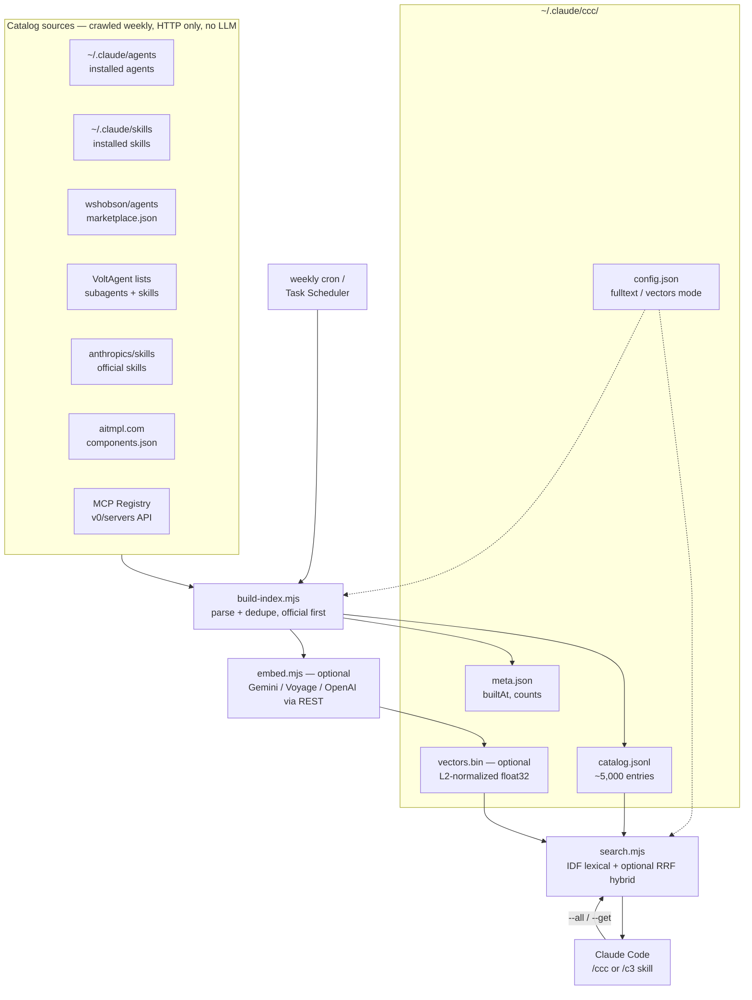
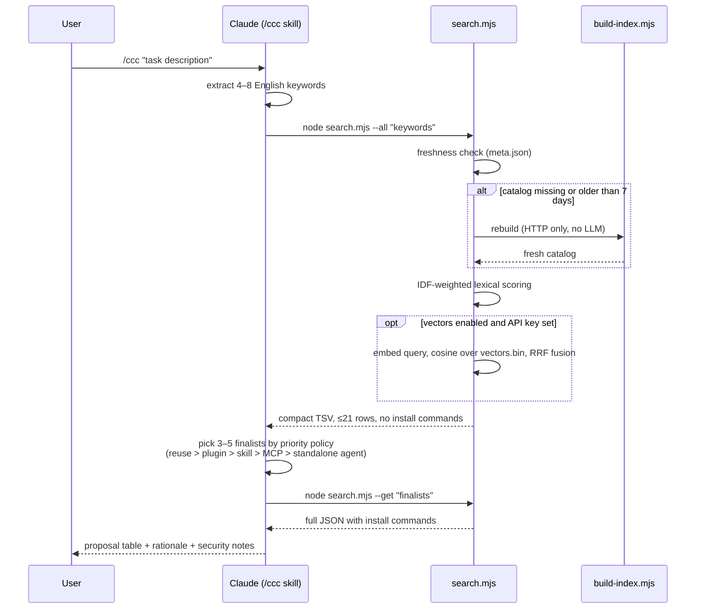

# c3 — Claude Code Concierge

**/ccc** (or **/c3**) tells you the best combination of Claude Code **plugins, subagents, and MCP servers** for whatever task you describe — using a **local RAG catalog** so that each recommendation costs almost zero tokens.

```
/ccc I want to build a Stripe subscription billing page
```

→ Returns a prioritized proposal table (what to reuse, what to install, what *not* to install) with ready-to-run install commands.

## Why

Asking an LLM to web-research the plugin/agent/MCP ecosystem on every request burns 100k+ tokens per question. c3 splits the work:

| Phase | Frequency | Cost |
|---|---|---|
| **Crawl** — build `~/.claude/ccc/catalog.jsonl` from public sources | weekly (auto-triggered when stale) | HTTP only, no LLM calls |
| **Retrieve** — IDF-weighted keyword search over the catalog | every request | milliseconds, zero API cost |
| **Propose** — Claude synthesizes the combination | every request | a few thousand tokens |

No embedding API, no npm dependencies — Node.js standard library only.

## How it works

### Architecture



### Query flow



## Catalog sources

- Your already-installed agents and skills (`~/.claude/agents/`, `~/.claude/skills/`) — reuse comes first
- [wshobson/agents](https://github.com/wshobson/agents) plugin marketplace (94 plugins)
- [VoltAgent/awesome-claude-code-subagents](https://github.com/VoltAgent/awesome-claude-code-subagents) (100+ agents)
- [anthropics/skills](https://github.com/anthropics/skills) — official Anthropic skills
- [VoltAgent/awesome-agent-skills](https://github.com/VoltAgent/awesome-agent-skills) — vendor & community skills
- [aitmpl.com](https://github.com/davila7/claude-code-templates) components catalog (800+ community skills)
- [Official MCP Registry](https://registry.modelcontextprotocol.io) (~2,300 active servers)

Add sources by editing `skills/ccc/scripts/build-index.mjs` (one function per source).

## Install

```sh
git clone https://github.com/happygoluckydev/c3.git
cd c3
sh install.sh        # Windows PowerShell: ./install.ps1
```

Then restart your Claude Code session and run `/ccc <task>` or `/c3 <task>`.

### Install options

| sh | PowerShell | Effect |
|---|---|---|
| (default) | (default) | Lexical search incl. document bodies (fulltext). Zero external services. |
| `--no-fulltext` | `-NoFulltext` | Lite: skip body indexing — catalog ~half the size, slightly lower recall. |
| `--vectors gemini\|voyage\|openai` | `-Vectors gemini` | Hybrid search: lexical + embedding ranks fused with RRF. Needs `GEMINI_API_KEY` / `VOYAGE_API_KEY` / `OPENAI_API_KEY`. Embedding cost ≈ $0.01 per full rebuild (5k short texts); queries are one embed call each. |

Options are stored in `~/.claude/ccc/config.json` — edit it (or re-run the installer) to switch modes. If the vector provider's API key is missing, everything gracefully falls back to lexical search.

## Keeping the catalog fresh

The skill already rebuilds the catalog lazily when it is older than 7 days.
To refresh it on a fixed schedule instead (no LLM tokens involved either way):

```sh
sh setup-schedule.sh      # macOS/Linux: weekly cron job (Mon 09:00)
```

```powershell
./setup-schedule.ps1      # Windows: weekly scheduled task (Mon 09:00)
```

## Recommendation policy

Proposals follow a strict priority order:

1. **No addition needed** — built-in features or already-installed agents win
2. **Plugins** — maintained bundles of agents + skills + commands
3. **MCP servers** — only when external service access is truly required (they cost resident context)
4. **Standalone community agents** — to fill remaining gaps

Community-made definition files can carry prompt-injection risks — c3 always reminds you to read them before installing.

## 日本語

タスクを伝えると「公式機能 → プラグイン → MCP → コミュニティ製エージェント」の優先順で最適な組み合わせを提案する Claude Code スキルです。クロールは週1回のバッチ（LLM 不使用）、提案時はローカル検索のみなのでクレジット消費を最小化できます。導入は `install.sh`（または `install.ps1`）を実行し、新しいセッションで `/ccc <やりたいこと>` を実行してください。

## License

MIT
